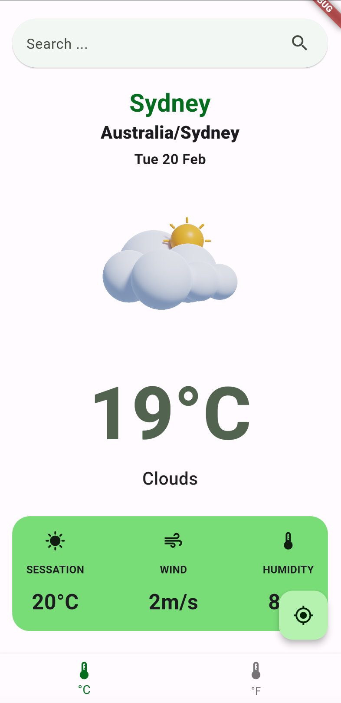

# weather_app

A application of Flutter with architecture using Clean Architecture, Mixin, Modular, Functional Programming, BloC
This architecture actualy used by an application in the App Store and Play Store more than 500k downloads.

## Weather Application

## Mobile Architecture in Flutter
------------------------------

Mobile architecture combines different approaches to create robust and scalable applications. This involves combining various design patterns and development methodologies to achieve optimal performance, maintainability, and scalability.

## Key Approaches:

-   Clean Architecture: This divides the application into well-defined layers:

    -   Data: for data access logic.
    -   Domain: for business logic and rules.
    -   Presenter: for the user interface and data presentation.
-   Modularization: Using libraries like `flutter_modular` allows for organizing code in independent and reusable modules. This simplifies dependency management and navigation between screens, making it easier to maintain large codebases.

-   Functional Programming: Implementing functional programming principles with libraries like `FPDart` and `DartZ` promotes cleaner and more predictable code. This involves using pure functions, immutable data types, and declarative error handling.

-   BLoC (Business Logic Component): This state management pattern separates business logic from the UI, facilitating reactivity and efficient state management. It allows for better code separation and testability.

Combining these approaches:

By combining modularity, functional programming, and state management through BLoC, along with the principles of cleanliness and separation of concerns from Clean Architecture, developers can create robust and maintainable mobile applications. This approach promotes code reusability, testability, scalability, and long-term maintainability.

## Benefits:

-   Improved code organization and maintainability.
-   Increased code reusability and testability.
-   Enhanced scalability and performance.
-   Simplified state management and UI updates.
-   Better separation of concerns and responsibilities.